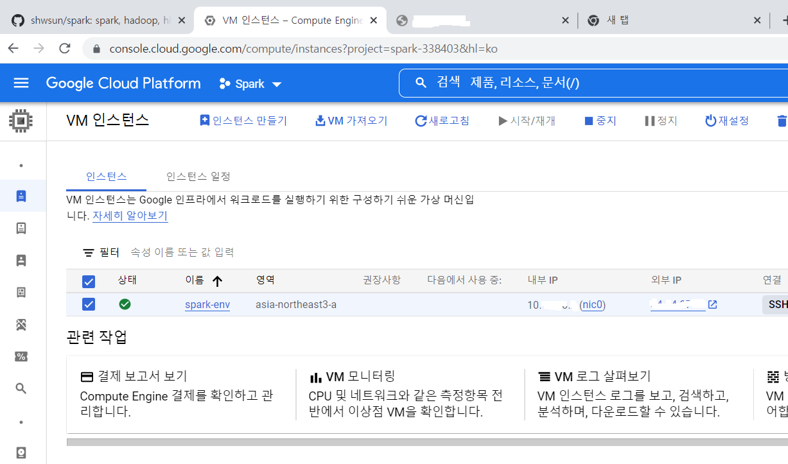
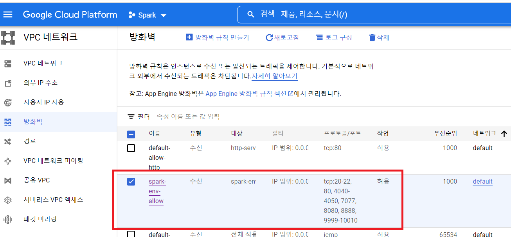

# GCP VM 설정하기  
spark-env, 8vCPU, RAM 32GB, HDD 50GB, Ubuntu 18.04 LTS  
e2-standard-8 : US$225.87, 시간당 약 US$0.31  
Firewall 정책에 tag spark-env-firewall 추가 : 20-22, 80, 4040-4050, 7077, 8080, 8088, 9999-10010 tcp v4 포트 오픈 조건 추가  
  
  
  

```bash
# ubuntu 18 image pull 
# gcr.io/gcp-runtimes/ubuntu_18_0_4:latest
gcloud auth configure-docker && docker pull marketplace.gcr.io/google/ubuntu1804:latest
```

1. GCP VM에 접속하기  

이후 모든 명령은 GCP VM에 접속해서 실행한다. 
  
2. install docker  
GCP VM 에 SSH 연결해서 명령창에서 아래와 같이 실행한다.  
```bash
sudo -i
apt-get update  
apt-get install -y ca-certificates curl gnupg lsb-release
curl -fsSL https://download.docker.com/linux/ubuntu/gpg | sudo gpg --dearmor -o /usr/share/keyrings/docker-archive-keyring.gpg
echo \
  "deb [arch=$(dpkg --print-architecture) signed-by=/usr/share/keyrings/docker-archive-keyring.gpg] https://download.docker.com/linux/ubuntu \
  $(lsb_release -cs) stable" | sudo tee /etc/apt/sources.list.d/docker.list > /dev/null
apt-get update
apt-get install -y docker-ce docker-ce-cli containerd.io
```
  
3. run spark-jupyter docker   
```bash
sudo -i 
mkdir /spark-test
docker run -itd --privileged --name spark-client --hostname spark-client --rm -p 80:8888 -p 4040-4050:4040-4050 -v /spark-test:/tf/notebooks shwsun/jupyter-spark
docker exec -it spark-client /bin/bash
jupyter lab --allow-root --ip='*' --NotebookApp.token='' --NotebookApp.password='' --workspace='/tf/notebooks' > /dev/null 2>&1 &   
docker network connect spark_default spark-client  

# run spark-client jupyter lab 
# port 4040 ~ is opened for using spark web ui.
docker run -itd --privileged --name spark-client --hostname spark-client --rm -p 80:8888 -p 4040-4050:4040-4050 -v /spark-test:/tf/notebooks shwsun/jupyter-spark jupyter lab --allow-root --ip='*' --NotebookApp.token='' --NotebookApp.password='' --workspace='/tf/notebooks' > /dev/null 2>&1 & 
```
  
4. Code-Server 설치하기  
간단하게 진행하기 위해 Docker constainer 버전으로 실행하고, 개발할 소스 코드 경로를 container 에 mount 해서 사용한다.  
아래에 다시 설명  

  
### Creating Kafka container  
```bash
mkdir -p /kafka/k0/data  

docker run -itd --privileged --name kafka1 --hostname kafka1 --rm ubuntu:18.04
docker run -itd --privileged --name kafka2 --hostname kafka2 --rm ubuntu:18.04

docker exec -it kafka1 /bin/bash  
docker exec -it kafka2 /bin/bash 

apt-get update 
apt-get install -y vim 
apt-get install -y openjdk-8-jdk  
update-alternatives --set java /usr/lib/jvm/java-8-openjdk-amd64/bin/java
export JAVA_HOME=/usr/lib/jvm/java-8-openjdk-amd64
vi /etc/hosts  

0.0.0.0 kafka1 
172.17.0.4 kafka2

0.0.0.0 kafka2 
172.17.0.3 kafka1

mkdir /zookeeper
cd /zookeeper 
wget http://apache.tt.co.kr/zookeeper/stable/apache-zookeeper-3.6.3-bin.tar.gz
tar -zxf apache-zookeeper-3.6.3-bin.tar.gz 
ln -s apache-zookeeper-3.6.3-bin zookeeper

cd zookeeper/conf
cp zoo_sample.cfg zoo.cfg
vi zoo.cfg


mkdir /data
echo 1 > /data/myid 
echo 2 > /data/myid

vi zoo.cfg
dataDir=/data
# add below
server.1=kafka1:2888:3888
server.2=kafka2:2888:3888

# in kafka1 
/zookeeper/zookeeper/bin/zkServer.sh start
```

Error:could not find or load main class org.apache.zookeeper.server.quorum.QuorumPeerMain 
java -cp zookeeper-3.4.6.jar:lib/log4j-1.2.16.jar: org.apache.zookeeper.server.quorum.QuorumPeerMain conf/zoo.cfg


---  
# Kafka 설치  
```bash
mkdir /kafka 
cd /kafka 
wget https://dlcdn.apache.org/kafka/3.0.0/kafka_2.12-3.0.0.tgz
```

---  
# code-server web connect
설치 등의 작업도 코드서버에서 진행하려면 코드 서버는 베어 메탈로 설치해야 한다.  

1. run code-server web using docker container  
2. git clone spark project  
3. enable git connection setting in code-server  
  
```bash 
sudo -i
# git clone 
mkdir /spark-git 
cd /spark-git
git clone https://github.com/shwsun/spark.git  

# code-server run 
# as user . exit from sudo -i 
#exit 
mkdir -p ~/.config
cd /spark-git/spark
# run code-server in background mode & expose port 80 as a external web connection port 
# if you want to use your own project is served as code-server work directory, move to that directory and run below.
# or change '$PWD' into your own directory path 
# cd /spark-git/spark
sudo docker run -it --name code-server -p 80:8080 \
  -v "$HOME/.config:/home/coder/.config" \
  -v "$PWD:/home/coder/project" \
  -u "$(id -u):$(id -g)" \
  -e "DOCKER_USER=$USER" \
  codercom/code-server:latest  > /dev/null 2>&1 & 
# to get login password for code-server 
cat ~/.config/code-server/config.yaml 
```
### code-server를 컨테이너로 사용할 경우  
```bash 
# code-server run 
# as user . exit from sudo -i 
#exit 
mkdir -p ~/.config
cd /spark-git/spark
# run code-server in background mode & expose port 80 as a external web connection port 
# if you want to use your own project is served as code-server work directory, move to that directory and run below.
# or change '$PWD' into your own directory path 
# cd /spark-git/spark
sudo docker run -it --name code-server -p 80:8080 \
  -v "$HOME/.config:/home/coder/.config" \
  -v "$PWD:/home/coder/project" \
  -u "$(id -u):$(id -g)" \
  -e "DOCKER_USER=$USER" \
  codercom/code-server:latest  > /dev/null 2>&1 & 
# to get login password for code-server 
cat ~/.config/code-server/config.yaml 
```
in code-server spark project 
```bash
cd /home/coder 
mkdir -p spark-prj 
cd spark-prj
git clone https://github.com/shwsun/spark.git
cd spark-prj 
git config --global user.name "<your name>"
git config --global user.email "<your email>"
# I need privileged connection to git hub shwsun/spark so that I need modifying this project.  
# git config --unset credential.helper
# git config credential.helper store  
git remote set-url origin "https://shwsun@github.com/shwsun/spark.git" 
# github personal access token setting 
git push --all
```
